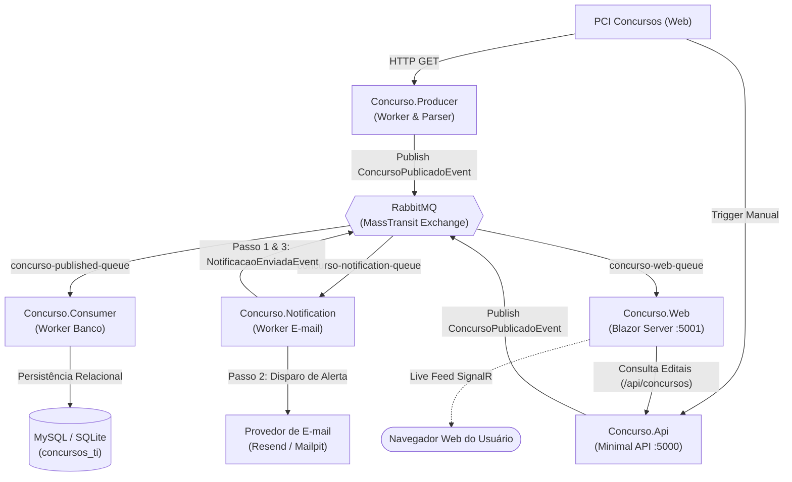
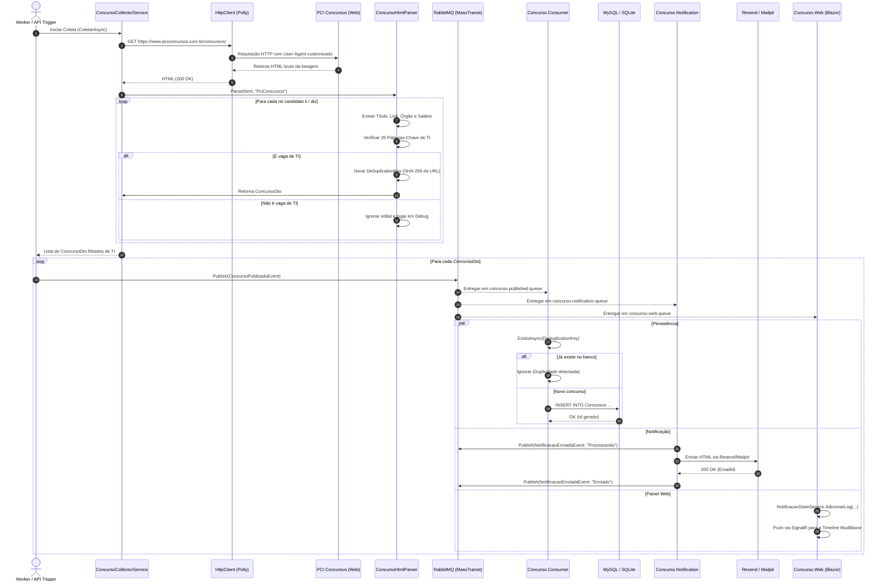
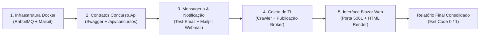

# Documentação Técnica Completa: ConcursosTI - Pipeline de Mensageria & Notificação

> **Padrão Arquitetural:** NotificaFlow  
> **Versão do Sistema:** 1.0.0 (.NET 8 LTS)  
> **Broker de Mensageria:** RabbitMQ via MassTransit 8.x  
> **Data de Atualização:** Setembro / 2026  

---

## 1. Visão Geral e Propósito do Sistema

O **ConcursosTI** é uma solução distribuída e resiliente projetada para automatizar o ciclo completo de monitoramento, triagem, publicação, persistência e notificação de oportunidades de concursos públicos com foco estrito na área de **Tecnologia da Informação (TI)** no Brasil.

### Principais Objetivos:
1. **Coleta Inteligente e Resiliente:** Monitorar fontes de concursos (como o PCI Concursos) via web scraping com políticas de retry exponencial e timeout gerenciadas por **Polly**.
2. **Filtragem Heurística de TI:** Triar o DOM HTML extraindo metadados estruturados (órgão, cargo, salário, descrição) e aplicando filtros por palavras-chave especializadas de TI para descartar concursos generalistas.
3. **Desacoplamento Assíncrono:** Empregar o padrão Publish/Subscribe com **RabbitMQ** e **MassTransit 8.x**, assegurando escalabilidade horizontal, tolerância a falhas e isolamento entre produtores e consumidores.
4. **Idempotência e Desduplicação Estrita:** Garantir que o mesmo edital não seja reinserido no banco nem renotificado aos candidatos, combinando hashes criptográficos (SHA-256), índices únicos de banco e caches de idempotência em memória.
5. **Notificação Multicanal Confiável:** Envio de e-mails transacionais com templates HTML modernos através da API do **Resend** (produção) ou do **Mailpit** (desenvolvimento local), com rastreamento em 3 etapas (*Processando*, *Tentando*, *Enviado*).
6. **Observabilidade e Painel em Tempo Real:** Dashboard interativo em **Blazor Server** com **MudBlazor**, conectado ao broker para exibir uma timeline ao vivo dos eventos trafegados via WebSockets / SignalR.
7. **Automação Operacional e de Testes via PowerShell:** Scripts de orquestração (`run-all.ps1`, `stop-all.ps1`) e testes automatizados de integração/E2E (`test-pipeline.ps1`).

---

## 2. Arquitetura da Solução

### 2.1 Diagrama de Arquitetura

```
+───────────────────────────────────────────────────────────────────────────────────────────+
|                                    FONTES EXTERNAS                                        |
|                     https://www.pciconcursos.com.br/concursos/                            |
+─────────────────────────────────────────────┬─────────────────────────────────────────────+
                                              │ HTTP GET (Polly: Retry + Timeout)
                                              ▼
+───────────────────────────────────────────────────────────────────────────────────────────+
|                  [Concurso.Producer] (Worker Service) / [Concurso.Api]                    |
|  - ConcursoCollectorService (HttpClientFactory)                                           |
|  - ConcursoHtmlParser (HtmlAgilityPack + 26 Palavras-Chave de TI + SHA-256)               |
+─────────────────────────────────────────────┬─────────────────────────────────────────────+
                                              │ IBus.Publish(ConcursoPublicadoEvent)
                                              ▼
+───────────────────────────────────────────────────────────────────────────────────────────+
|                                  BROKER DE MENSAGERIA                                     |
|                           RabbitMQ (MassTransit Fanout Exchanges)                         |
+──────────────┬──────────────────────────────┼──────────────────────────────┬──────────────+
               │                              │                              │
               │                              │                              │
               ▼                              ▼                              ▼
+──────────────────────────────+ +──────────────────────────────+ +──────────────────────────+
|      [Concurso.Consumer]     | |   [Concurso.Notification]    | |      [Concurso.Web]      |
| Fila:                        | | Fila:                        | | Fila:                    |
| concurso-published-queue     | | concurso-notification-queue  | | concurso-web-queue       |
|                              | |                              | |                          |
| - ConcursoPublicadoConsumer  | | - ConcursoPublicadoConsumer  | | - NotificacaoEnviada-    |
| - Verif. DeduplicationKey    | | - Idempotência por Hash      | |   Consumer               |
| - EF Core MySQL / SQLite     | | - Passo 1: Publica Notif.    | | - Atualiza StateService  |
| - Persiste ConcursoEntity    | | - Passo 2: IEmailSender      | | - MudBlazor Timeline     |
|                              | |   (Resend API / Mailpit SMTP)| |   em tempo real via      |
|                              | | - Passo 3: Notificação OK    | |   SignalR                |
+──────────────┬───────────────+ +──────────────┬───────────────+ +──────────────────────────+
               │                                │
               │                                └──── Publica NotificacaoEnviadaEvent ───┐
               ▼                                                                         │
+──────────────────────────────+                                                         │
|        BANCO DE DADOS        |                                                         │
| MySQL 8.0 / SQLite           |<────────────────────────────────────────────────────────┘
| Tabela: Concursos            |
+──────────────────────────────+
```

### 2.2 Diagrama Mermaid da Arquitetura e Fluxo de Dados



### 2.3 Projetos da Solução

| Projeto | Tipo | Responsabilidade Técnica | Tecnologias Chave |
|---|---|---|---|
| **`Concurso.Producer`** | Worker Service | Agendamento periódica do ciclo de coleta, requisição resiliente HTTP, parsing de páginas HTML e publicação no RabbitMQ. | .NET 8, `HtmlAgilityPack`, `Polly`, `MassTransit` |
| **`Concurso.Api`** | Minimal Web API | Interface RESTful e Swagger para consultas operacionais, acionamento sob demanda de coleta e disparo de testes. | ASP.NET Core Minimal API, `Swagger/OpenAPI`, `Serilog` |
| **`Concurso.Consumer`** | Worker Service | Consumo de editais da fila, validação de unicidade com chave hash e gravação no banco relacional. | .NET 8, `EF Core`, `Pomelo MySQL`, `MassTransit` |
| **`Concurso.Notification`** | Worker Service | Orquestração do pipeline de notificações em 3 passos, renderização de templates HTML responsivos e envio via Resend/Mailpit. | `Resend .NET SDK`, `System.Net.Mail`, `MassTransit` |
| **`Concurso.Web`** | Web App (Blazor) | Interface de usuário rica com MudBlazor, estatísticas, disparos manuais, timeline reativa de mensageria e grid de vagas. | `Blazor Server`, `MudBlazor`, `SignalR`, `MassTransit` |
| **`Concurso.Messaging`** | Class Library | Contratos imutáveis de eventos de domínio compartilhados entre os microsserviços. | C# Records, `MassTransit.Abstractions` |
| **`Concurso.Shared`** | Class Library | Infraestrutura compartilhada de métricas em memória, health checks e modelos de opções (`IOptions`). | `Microsoft.Extensions.Diagnostics.HealthChecks` |

---

## 3. Destaque: Fluxo Completo de Coleta de Concursos de TI

O fluxo de coleta de concursos de TI constitui o núcleo de inteligência da solução. A seguir, cada etapa do ciclo é esmiuçada tecnicamente.



### 3.1 Camada de Requisição e Resiliência (Polly)

A extração de páginas da web está sujeita a instabilidades de rede, limites de taxa ou timeouts. No projeto `Concurso.Producer` e na `Concurso.Api`, a injeção do cliente HTTP é protegida com uma cadeia de políticas do **Polly**:

```csharp
var retryPolicy = HttpPolicyExtensions
    .HandleTransientHttpError()
    .Or<TimeoutRejectedException>()
    .WaitAndRetryAsync(new[]
    {
        TimeSpan.FromSeconds(1),
        TimeSpan.FromSeconds(3),
        TimeSpan.FromSeconds(7)
    });

var timeoutPolicy = Policy.TimeoutAsync<HttpResponseMessage>(TimeSpan.FromSeconds(15));
```

- **User-Agent Customizado:** O header `User-Agent: Mozilla/5.0 (compatible; ConcursosTI-Bot/1.0)` é anexado para prevenir bloqueios por bots genéricos.
- **Ciclo de Vida do Handler:** Configurado com `SetHandlerLifetime(TimeSpan.FromMinutes(5))` para garantir rotação periódica de DNS sem esgotar sockets TCP.

### 3.2 O Algoritmo de Parsing e Heurísticas de TI (`ConcursoHtmlParser`)

O parser HTML implementado com a biblioteca **HtmlAgilityPack** realiza quatro procedimentos analíticos:

#### A. Seleção Estrutural (XPath)
Testa seletores XPath candidatos para cobrir variações de layout do site:
1. `//*[@id='pagina']/aside[1]/ul/li`
2. `//ul[contains(@class,'ultimas-noticias')]/li`
3. `//div[contains(@class,'da')]`
4. `//article`

#### B. Extração de Metadados via Expressões Regulares
- **Órgão Promotor:** Extraído através de uma regex que detecta os verbos típicos de anúncio:
  ```csharp
  [GeneratedRegex(@"^(.+?)\s+(abre?|lança|publica|realiza|seleciona|oferece|divulga|encerra|prorroga)\s+", RegexOptions.IgnoreCase)]
  ```
- **Remuneração:** Extraída do atributo descritivo do edital:
  ```csharp
  [GeneratedRegex(@"R\$\s?[\d.,]+", RegexOptions.IgnoreCase)]
  ```

#### C. Classificação e Filtragem por Palavras-Chave de TI
O parser avalia a combinação de título e descrição contra uma lista rigorosa de termos da área de tecnologia:

```csharp
private static readonly HashSet<string> PalavrasChaveTi = new(StringComparer.OrdinalIgnoreCase)
{
    "analista de sistemas", "analista de ti", "desenvolvedor", "programador",
    "engenheiro de software", "arquiteto de software", "analista de infraestrutura",
    "analista de redes", "administrador de redes", "segurança da informação",
    "banco de dados", "dba", "suporte técnico", "técnico de ti",
    "técnico de informática", "ciência de dados", "inteligência artificial",
    "machine learning", "devops", "cloud", "tecnologia da informação",
    "tecnologia da informação e comunicação", "tic", "informática",
    "sistemas de informação", "engenharia da computação", "ciência da computação"
};
```
Editais que não satisfazem ao menos um dos critérios são descartados na fase de triagem, reduzindo tráfego no broker e custo de processamento.

#### D. Geração da Chave de Desduplicação (`DeduplicationKey`)
A chave de desduplicação é obtida a partir do hash **SHA-256** dos primeiros 16 bytes da URL do edital normalizada (convertida para minúsculas e sem espaços adicionais):

```csharp
private static string GerarChaveDeduplicacao(string link)
{
    var bytes = SHA256.HashData(Encoding.UTF8.GetBytes(link.ToLowerInvariant().Trim()));
    return Convert.ToHexString(bytes[..16]).ToLowerInvariant();
}
```
Isso gera uma chave estável de 32 caracteres hexadecimais (ex: `a1b2c3d4e5f67890123456789abcdef0`).

### 3.3 Esquema do Evento de Domínio (`ConcursoPublicadoEvent`)

```json
{
  "EventId": "3fa85f64-5717-4562-b3fc-2c963f66afa6",
  "DeduplicationKey": "4c8f9b1e72a049d5bf1c2e3d4a5b6c7d",
  "Titulo": "Dataprev abre concurso público com vagas para Engenharia de Software",
  "Orgao": "Dataprev",
  "Cargo": "Analista de Tecnologia da Informação",
  "Salario": "R$ 15.300,00",
  "Link": "https://www.pciconcursos.com.br/concursos/nacional/dataprev-abre-concurso-ti",
  "DataPublicacao": "2026-09-04T13:15:00Z",
  "DataCaptura": "2026-09-04T13:15:30Z",
  "Fonte": "PciConcursos",
  "Descricao": "Vagas para atuação em arquitetura cloud, microsserviços e mensageria."
}
```

---

## 4. Mecanismos de Testes nos Arquivos PowerShell

A solução dispõe de um ecossistema completo de automação em PowerShell para orquestração local e validação contínua da saúde dos serviços.

### 4.1 Inventário de Arquivos PowerShell

| Arquivo | Finalidade | Principais Comandos e Técnicas |
|---|---|---|
| **`run-all.ps1`** | Inicialização em comando único de toda a infraestrutura e microsserviços. | `docker compose up -d`, `Start-Process powershell`, `$Host.UI.RawUI.WindowTitle`, `Start-Sleep` |
| **`stop-all.ps1`** | Encerramento gracioso de todos os processos da solução. | `Get-Process`, `Stop-Process -Force`, consulta WMI via `Get-CimInstance Win32_Process` |
| **`test-pipeline.ps1`** | Suíte de testes automatizados E2E, validação de contratos, filas e APIs. | `Invoke-RestMethod`, `Invoke-WebRequest`, `Stopwatch`, HTTP Basic Auth, validação de códigos HTTP e payloads JSON |

---

### 4.2 Detalhamento do `test-pipeline.ps1` (Mecanismo de Testes Automatizados)

O script `test-pipeline.ps1` atua como uma ferramenta de **Smoke Testing** e **Testes de Integração de Ponta a Ponta (E2E)**. Ele pode ser disparado em ambientes locais ou pipelines de CI/CD (ex: GitHub Actions).

#### Parâmetros de Execução do Script:

```powershell
param (
    [string]$ApiBaseUrl = "http://localhost:5000",       # Endpoint da Concurso.Api
    [string]$WebBaseUrl = "http://localhost:5001",       # Endpoint do Concurso.Web
    [string]$RabbitMqHttpUrl = "http://localhost:15672", # API do RabbitMQ Management
    [string]$MailpitHttpUrl = "http://localhost:8025",   # API REST do Mailpit Webmail
    [int]$TimeoutSeconds = 10,                           # Timeout por teste individual
    [switch]$SkipCollectorScrape = $false                # Opcional: pula requisição externa
)
```

#### Mecanismos de Assert e Telemetria:
O script encapsula cada teste na função de alta ordem `Assert-Test`, que:
1. Instancia um cronômetro `System.Diagnostics.Stopwatch`.
2. Executa o ScriptBlock de teste sob proteção de `try/catch`.
3. Valida a resposta (status HTTP, propriedades JSON, tipo de dado).
4. Registra métricas de duração em milissegundos.
5. Imprime o status colorido (`[PASSOU]` em verde, `[FALHOU]` em vermelho).
6. Consolida o resultado em uma lista para o relatório final.

#### As 5 Baterias de Testes:



1. **Bateria 1: Infraestrutura Docker e Portas de Rede**
   - **RabbitMQ Management HTTP API:** Efetua chamada autenticada (`guest:guest` em Base64) para `http://localhost:15672/api/overview`. Valida se o broker está ativo e extrai a versão do nó.
   - **Mailpit Webmail API:** Consulta `http://localhost:8025/api/v1/info` garantindo que o servidor SMTP simulado está pronto para receber e-mails.

2. **Bateria 2: Concurso.Api (Minimal API)**
   - **OpenAPI / Swagger Spec:** Executa `GET /swagger/v1/swagger.json` e assegura que a especificação retorna status 200 e que o título é `Concursos TI - API & Mensageria`.
   - **Consulta de Concursos:** Executa `GET /api/concursos` e valida se a resposta é uma matriz JSON deserializável.

3. **Bateria 3: Disparo de Eventos e Mensageria**
   - **Publicação via Minimal API:** Executa `POST /api/concursos/test-email` passando órgão, cargo e remuneração codificados em URL. Confirma a geração de um `EventId` e a publicação na exchange do broker.
   - **Inspeção de Caixa de E-mail (Mailpit):** Aguarda a propagação assíncrona (2 segundos) e consulta a API `GET http://localhost:8025/api/v1/messages` para confirmar que o `Worker.Email` consumiu o evento e entregou a mensagem.

4. **Bateria 4: Fluxo Real de Coleta de TI**
   - Executa `POST /api/concursos/coletar`, que aciona o `ConcursoCollectorService`, faz a varredura ao vivo na web, roda o `ConcursoHtmlParser`, filtra pelas 26 palavras-chave e publica no RabbitMQ.
   - O teste valida a presença do campo `TotalPublicados` e a integridade da resposta.

5. **Bateria 5: Painel Web (Blazor Server)**
   - Executa `Invoke-WebRequest` contra `http://localhost:5001/` e valida status code `200 OK` e a presença do identificador `ConcursosTI` no DOM gerado pelo servidor.

#### Como Executar a Suíte de Testes:

```powershell
# Execução padrão completa
.\test-pipeline.ps1

# Execução rápida (pulando a varredura externa de web scraping)
.\test-pipeline.ps1 -SkipCollectorScrape
```

---

### 4.3 Script de Inicialização (`run-all.ps1`)

O script orquestra o ciclo de inicialização na ordem de dependência correta:
1. **Infraestrutura em Containers:** Executa `docker compose up -d` para instanciar RabbitMQ (portas 5672 e 15672) e Mailpit (portas 1025 e 8025).
2. **Concurso.Api:** Inicia a API REST em uma janela PowerShell dedicada com título descritivo (`$Host.UI.RawUI.WindowTitle = 'Concurso.Api (Porta 5000)'`).
3. **Concurso.Notification:** Inicia o worker de envio de e-mails em janela dedicada.
4. **Concurso.Consumer:** Inicia o consumidor de persistência relacional.
5. **Concurso.Web:** Inicia o painel Blazor Server na porta 5001.
6. **Abertura do Navegador:** Aguarda 6 segundos para estabilização do pipeline e dispara `Start-Process "http://localhost:5001"`.

---

### 4.4 Script de Encerramento (`stop-all.ps1`)

O script garante o encerramento limpo sem deixar instâncias zumbis em execução:
1. Varre processos por nome de executável (`Concurso.Api`, `Concurso.Notification`, `Concurso.Consumer`, `Concurso.Web`, `Concurso.Producer`).
2. Varre instâncias do `dotnet.exe` que possuam comandos referenciando os arquivos `.csproj` da solução através do WMI/CIM:
   ```powershell
   Get-CimInstance Win32_Process | Where-Object { $_.CommandLine -like "*Concurso.*.csproj*" } | ForEach-Object {
       Stop-Process -Id $_.ProcessId -Force -ErrorAction SilentlyContinue
   }
   ```

---

## 5. Logs Estruturados das Principais Operações dos Projetos

Esta seção documenta a assinatura e o conteúdo exato dos logs gerados por cada componente da solução, cobrindo cenários de sucesso, avisos de desduplicação e tratamento de falhas.

---

### 5.1 Logs do `Concurso.Producer` (Worker de Coleta e Parsing de TI)

#### Cenário: Execução do Ciclo Periódico de Coleta e Publicação

```text
[10:30:00 INF] Worker de Coleta iniciado. Ciclo de coleta configurado a cada 01:00:00.
[10:30:00 INF] Iniciando ciclo de coleta de concursos de TI em 2026-09-04T13:30:00.0000000+00:00
[10:30:00 INF] Executando fonte PCI Concursos
[10:30:00 INF] Iniciando coleta de concursos. Fonte: PciConcursos | URL: https://www.pciconcursos.com.br/concursos/
[10:30:00 DBG] Requisição GET iniciada. URL: https://www.pciconcursos.com.br/concursos/
[10:30:01 DBG] HTML recebido. Status: 200 | Tamanho: 148520 bytes
[10:30:01 DBG] Encontrados 124 nós candidatos. Fonte: PciConcursos
[10:30:01 DBG] Concurso ignorado por não ser área de TI. Cargo: 'Médico Clínico Geral' | Fonte: PciConcursos
[10:30:01 DBG] Concurso ignorado por não ser área de TI. Cargo: 'Professor de Educação Infantil' | Fonte: PciConcursos
[10:30:01 DBG] Concurso extraído: 'Dataprev abre processo seletivo para Engenharia de Software' | Cargo: 'engenheiro de software'
[10:30:01 DBG] Concurso extraído: 'Tribunal Regional Federal lança edital com vagas para Analista de Redes' | Cargo: 'analista de redes'
[10:30:01 INF] Parse concluído. 2 de 124 itens são relevantes para TI. Fonte: PciConcursos
[10:30:01 INF] Fonte PCI Concursos retornou 2 item(s)
[10:30:01 INF] Coleta finalizada. Encontrados 2 concurso(s) relevantes de TI.
[10:30:02 INF] Concurso de TI publicado no broker | Key: 7e2f5b8a1c9d40e3a6f123456789abcd | Cargo: engenheiro de software | Órgão: Dataprev
[10:30:02 INF] Concurso de TI publicado no broker | Key: 9a8b7c6d5e4f3a2b1c0d9e8f7a6b5c4d | Cargo: analista de redes | Órgão: Tribunal Regional Federal
[10:30:02 INF] Ciclo concluído. Novos concursos publicados neste lote: 2
[10:30:02 INF] Próxima coleta agendada em 01:00:00.
```

---

### 5.2 Logs do `Concurso.Consumer` (Persistência Relacional e Desduplicação)

#### Cenário 1: Recepção e Gravação de Novo Edital no Banco

```text
[10:30:02 INF] Consumo evento ConcursoPublicado | Key: 7e2f5b8a1c9d40e3a6f123456789abcd | Fonte: PciConcursos
[10:30:02 INF] Executed DbCommand (1ms) [Parameters=[@__key_0='7e2f5b8a1c9d40e3a6f123456789abcd' (Nullable = false) (Size = 64)], CommandType='Text', CommandTimeout='30']
      SELECT EXISTS (
          SELECT 1
          FROM `Concursos` AS `c`
          WHERE `c`.`DeduplicationKey` = @__key_0)
[10:30:02 INF] Executed DbCommand (3ms) [Parameters=[@p0='7e2f5b8a1c9d40e3a6f123456789abcd', @p1='Dataprev', @p2='engenheiro de software', @p3='R$ 15.300,00', ...], CommandType='Text']
      INSERT INTO `Concursos` (`DeduplicationKey`, `Orgao`, `Cargo`, `Salario`, ...)
      VALUES (@p0, @p1, @p2, @p3, ...);
[10:30:02 INF] Persistência realizada | Key: 7e2f5b8a1c9d40e3a6f123456789abcd | Id: 1
```

#### Cenário 2: Detecção de Concurso Já Existente (Idempotência Ativada)

```text
[10:35:10 INF] Consumo evento ConcursoPublicado | Key: 7e2f5b8a1c9d40e3a6f123456789abcd | Fonte: PciConcursos
[10:35:10 INF] Executed DbCommand (1ms) [Parameters=[@__key_0='7e2f5b8a1c9d40e3a6f123456789abcd'], CommandType='Text']
      SELECT EXISTS (...)
[10:35:10 INF] Duplicidade detectada | Key: 7e2f5b8a1c9d40e3a6f123456789abcd
```

---

### 5.3 Logs do `Concurso.Notification` (Worker de Envio de E-mail)

#### Cenário 1: Envio com Sucesso em 3 Passos via Resend API

```text
[10:30:02 INF] [Email] [Passo 1/3] Recebendo evento de concurso. Key: 7e2f5b8a1c9d40e3a6f123456789abcd | Cargo: engenheiro de software | Órgão: Dataprev | Destinatário: candidato.ti@dominio.com
[10:30:02 INF] [Email] [Passo 2/3] Enviando e-mail com template rico para candidato.ti@dominio.com...
[10:30:02 INF] [ResendEmailSender] Enviando e-mail para candidato.ti@dominio.com via Resend API...
[10:30:03 INF] [ResendEmailSender] E-mail enviado com sucesso via Resend para candidato.ti@dominio.com (EmailId: 49a3999c-0ce1-4ea6-ab68-af1f2d794477)
[10:30:03 INF] [Email] [Passo 3/3] E-mail entregue com sucesso para candidato.ti@dominio.com (Key: 7e2f5b8a1c9d40e3a6f123456789abcd, EventId: 3fa85f64-5717-4562-b3fc-2c963f66afa6)
```

#### Cenário 2: Envio via Mailpit (Ambiente de Desenvolvimento Local)

```text
[10:30:02 INF] [Email] [Passo 1/3] Recebendo evento de concurso. Key: 9a8b7c6d5e4f3a2b1c0d9e8f7a6b5c4d | Cargo: analista de redes | Órgão: Tribunal Regional Federal | Destinatário: dev@concursos-ti.com
[10:30:02 INF] [Email] [Passo 2/3] Enviando e-mail com template rico para dev@concursos-ti.com...
[10:30:02 INF] [MailpitEmailSender] Enviando e-mail para dev@concursos-ti.com via Mailpit (localhost:1025)...
[10:30:02 INF] [MailpitEmailSender] E-mail entregue ao Mailpit com sucesso para dev@concursos-ti.com
[10:30:02 INF] [Email] [Passo 3/3] E-mail entregue com sucesso para dev@concursos-ti.com (Key: 9a8b7c6d5e4f3a2b1c0d9e8f7a6b5c4d, EventId: 4fb96a75-6828-4673-c4ad-3d074a77b0b7)
```

#### Cenário 3: Falha Temporária de Conexão com Disparo de Retry do MassTransit

```text
[10:30:02 INF] [Email] [Passo 2/3] Enviando e-mail com template rico para candidato.ti@dominio.com...
[10:30:05 ERR] [ResendEmailSender] Falha ao enviar via Resend: Connection timed out.
[10:30:05 ERR] [Email] [Passo 2/3] Falha no envio de e-mail para candidato.ti@dominio.com. O MassTransit acionará política de retry...
System.InvalidOperationException: Falha no Resend: Connection timed out.
   at Concurso.Notification.Services.ResendEmailSender.SendAsync(...)
   at Concurso.Notification.Consumers.ConcursoPublicadoConsumer.Consume(...)
[10:30:10 INF] [Email] [Passo 2/3] (Retry 1/3) Enviando e-mail com template rico para candidato.ti@dominio.com...
[10:30:11 INF] [ResendEmailSender] E-mail enviado com sucesso via Resend para candidato.ti@dominio.com (EmailId: 58b2111d-1df2-5fb7-bc79-bf2e3e805588)
[10:30:11 INF] [Email] [Passo 3/3] E-mail entregue com sucesso para candidato.ti@dominio.com
```

---

### 5.4 Logs do `Concurso.Api` (Minimal API e Swagger)

#### Cenário: Consulta da Lista de Editais e Acionamento Manual de Coleta

```text
[10:31:00 INF] HTTP GET /api/concursos responded 200 in 12.4589 ms
[10:31:15 INF] HTTP POST /api/concursos/coletar responded 200 in 1845.1200 ms
[10:31:30 INF] HTTP POST /api/concursos/test-email?orgao=Dataprev&cargo=Analista+de+TI responded 200 in 8.3120 ms
```

---

### 5.5 Logs do `Concurso.Web` (Blazor Server e MudBlazor Timeline)

#### Cenário: Recepção de Eventos da Fila e Notificação da UI via SignalR

```text
[10:30:02 INF] [Web] Recebido ConcursoPublicadoEvent: engenheiro de software (Dataprev) - Key 7e2f5b8a1c9d40e3a6f123456789abcd
[10:30:02 INF] [Web] Recebido NotificacaoEnviadaEvent: Email - Processando para Key 7e2f5b8a1c9d40e3a6f123456789abcd
[10:30:03 INF] [Web] Recebido NotificacaoEnviadaEvent: Email - Enviado para Key 7e2f5b8a1c9d40e3a6f123456789abcd
```

---

## 6. Configuração e Variáveis de Ambiente

### 6.1 Portas e Endpoints da Solução

| Serviço | Porta Local | Protocolo | Descrição |
|---|---|---|---|
| **Concurso.Api** | `5000` | HTTP | Minimal API e documentação Swagger (`/`) |
| **Concurso.Web** | `5001` | HTTP | Painel Blazor Server interativo |
| **RabbitMQ AMQP** | `5672` | AMQP | Porta de comunicação de mensagens MassTransit |
| **RabbitMQ UI** | `15672` | HTTP | Painel de controle de filas e exchanges (`guest/guest`) |
| **Mailpit SMTP** | `1025` | SMTP | Porta para recebimento de e-mails em desenvolvimento |
| **Mailpit UI** | `8025` | HTTP | Interface Web de visualização de mensagens |
| **MySQL** | `3306` / `3307` | TCP | Banco de dados relacional de editais |

---

### 6.2 Configuração do Provedor de E-mail (Resend vs Mailpit)

O arquivo `Concurso.Notification/appsettings.json` suporta a alternância transparente entre **Resend** (provedor em nuvem) e **Mailpit** (SMTP local).

#### Para Produção / Testes Reais com Resend:
```bash
cd Concurso.Notification
dotnet user-secrets set "Email:Provider" "Resend"
dotnet user-secrets set "Resend:ApiKey" "re_sua_api_key_aqui"
dotnet user-secrets set "Email:To" "seu_email_real@dominio.com"
```

#### Para Desenvolvimento Offline sem Cota com Mailpit:
No `appsettings.json` do `Concurso.Notification`:
```json
{
  "Email": {
    "Provider": "Mailpit",
    "To": "candidato.ti@exemplo.com",
    "From": "alertas@concursos-ti.com",
    "FromName": "Concursos TI - Notificações",
    "Mailpit": {
      "Host": "localhost",
      "Port": 1025
    }
  }
}
```

---

## 7. Guia de Operação e Resolução de Problemas (Troubleshooting)

### A. As mensagens não aparecem na Timeline do Painel Web
1. Verifique se o container do RabbitMQ está rodando: `docker ps`.
2. Acesse `http://localhost:15672` e verifique se a fila `concurso-web-queue` existe e se possui conexões ativas.
3. Certifique-se de que o projeto `Concurso.Web` foi iniciado após o RabbitMQ estar acessível.

### B. Erro de autenticação ou cota no Resend
- Se o console do `Concurso.Notification` acusar `Falha no Resend: restricted_api_key` ou `Unauthorized`:
  - Alterne para o Mailpit local configurando `"Email:Provider": "Mailpit"` no `appsettings.json`.
  - Ou cadastre uma chave válida do Resend via `dotnet user-secrets`.

### C. O teste automatizado `test-pipeline.ps1` falhou
- Execute o script verificando qual bateria acusou falha:
  - Se falhou na **Bateria 1**: O Docker não está em execução. Rode `docker compose up -d`.
  - Se falhou na **Bateria 2**: A API não subiu na porta 5000. Verifique se outra aplicação está usando a porta.
  - Se falhou na **Bateria 3**: Verifique a conexão com o broker RabbitMQ.
